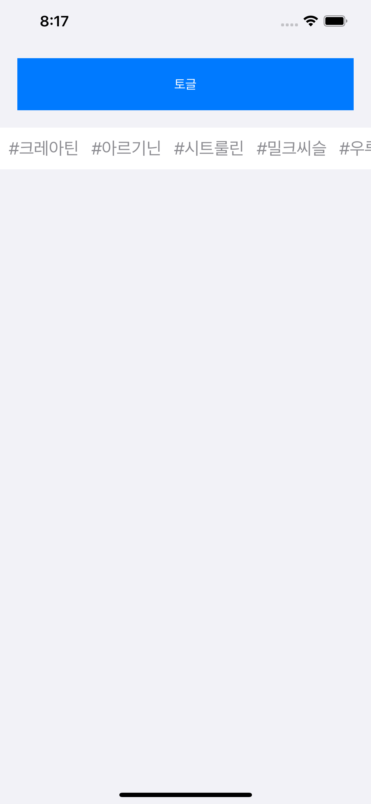
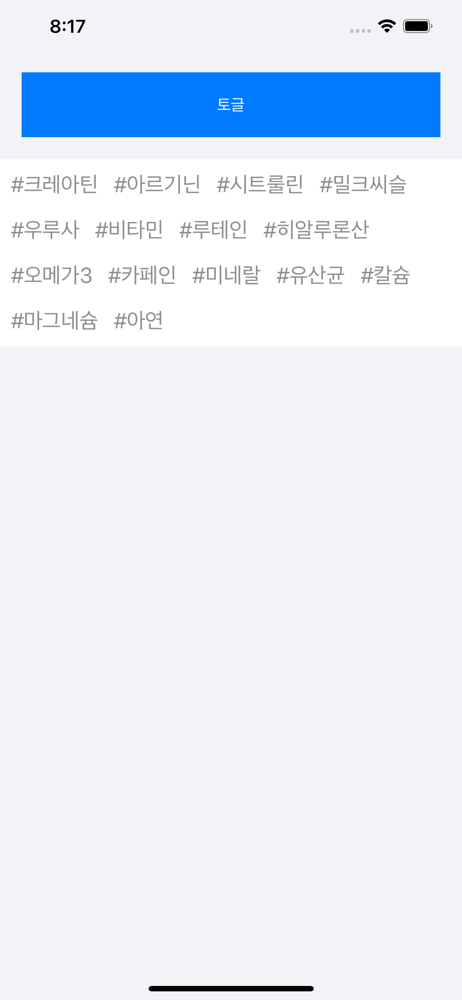

# :octocat: 

## [iOS/Swift Example] 태그 목록 UI (가로스크롤/리스팅 전환) 샘플

 

- 태그 목록이 한줄로 나오고 가로로 스크롤이 가능
- 같은 태그 목록이 버튼을 누르면 펼쳐저서 전체 목록이 보여짐

---

### 프로젝트 열기

- Cocoapod으로 라이브러리 설치가 필요합니다.

```
pod install
open inlineTagsExam.xcworkspace
```

### 사용한 라이브러리

- [AlignedCollectionViewFlowLayout](https://github.com/mischa-hildebrand/AlignedCollectionViewFlowLayout)

